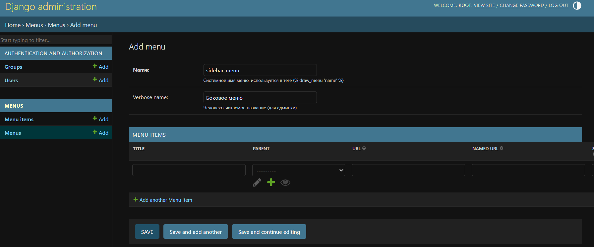
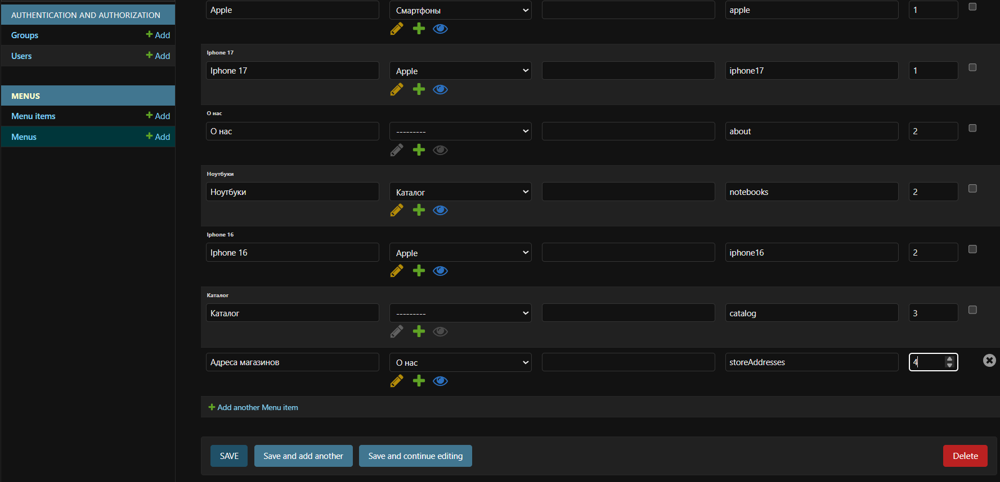
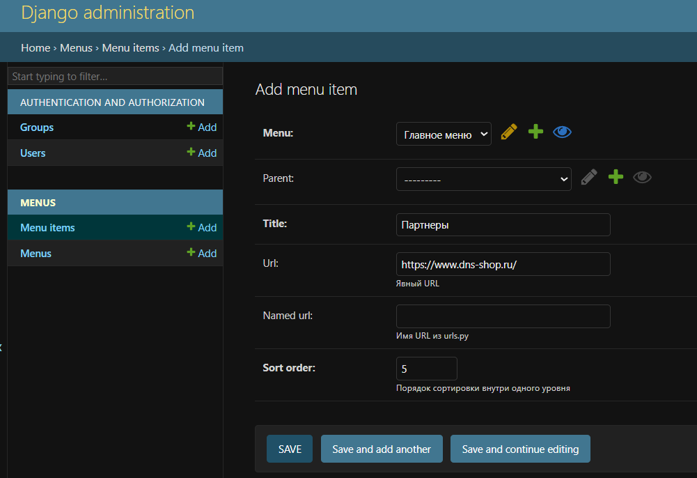
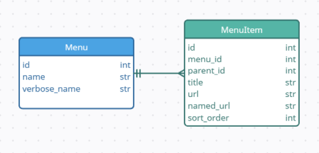

# Django Tree Menu

Это небольшое Django-приложение реализует **древовидное меню**, редактируемое через админку и выводимое через template tag с определением активного пункта по URL и построением всей структуры за один SQL-запрос. Проект реализован в рамках тестового задания от компании "АпТрейдер (UpTrader)".

---

## Содержание

- [1. Запуск проекта](#1-запуск-проекта)
  - [1.1. Запуск через Docker](#11-запуск-через-docker-рекомендуется)
  - [1.2. Локальный запуск без Docker](#12-запуск-локально-без-docker)
- [2. Создание новых пунктов в меню](#2-создание-новых-пунктов-в-меню)
  - [2.1. Добавление нового меню на страницу](#21-добавление-нового-меню-на-страницу)
  - [2.2. Создание новых пунктов меню через внутренний named_url](#22-создание-новых-пунктов-меню-через-внутренний-named_url)
  - [2.3. Создание новых пунктов меню через явный url](#23-создание-новых-пунктов-меню-через-явный-url)
- [3. Модели](#3-модели)
  - [3.1. Схема базы данных](#31-схема-базы-данных)
  - [3.2. Menu](#32-menu)
  - [3.3. MenuItem](#33-menuitem)
- [4. Особенности реализации](#4-особенности-реализации)
  - [4.1. Один SQL-запрос](#41-один-sql-запрос)
  - [4.2. Определение активного пункта](#42-определение-активного-пункта)
  - [4.3. Раскрытие веток](#43-раскрытие-веток)
  - [4.4. Пример дерева меню](#44-пример-дерева-меню)
- [5. Внешний вид](#5-внешний-вид)
- [6. Автор](#6-автор)

---

## 1. Запуск проекта

### 1.1. Запуск через Docker (рекомендуется)

#### 1.1.1. Сборка образа

```bash
docker build -t django-menu-app .
```

#### 1.1.2. Запуск контейнера

```bash
docker run -p 8000:8000 django-menu-app
```

Контейнер автоматически выполнит:

- миграции (`migrate`)
- загрузку тестовых данных для заполнения таблицы в БД (`loaddata initial_menu`)
- запуск сервера

> Меню будет полностью готово «из коробки».

Приложение будет доступно по адресу:  
**http://127.0.0.1:8000/** или **http://localhost:8000/**

#### 1.1.3. Создание суперпользователя

Посмотреть запущенные контейнеры:

```bash
docker ps
```

Выполнить команду createsuperuser внутри контейнера:
```bash
docker exec -it <container_id> python manage.py createsuperuser
```

> Где <container_id> — это значение из первой колонки вывода docker ps.

Далее следуйте стандартным вопросам Django: укажите логин, email (можно любой) и пароль.
После этого админка будет доступна по адресу **http://localhost:8000/admin/**

---

### 1.2. Запуск локально (без Docker)

#### 1.2.1. Установка зависимостей
    
```bash
pip install -r requirements.txt
```

#### 1.2.2. Применение миграций

```bash
python manage.py migrate
```

#### 1.2.3. Загрузка тестовых данных

```bash
python manage.py loaddata initial_menu
```

#### 1.2.4. Запуск сервера

```bash
python manage.py runserver
```
Приложение будет доступно по адресу:  
**http://127.0.0.1:8000/** или **http://localhost:8000/**

#### 1.2.5. Создание суперпользователя

```bash
python manage.py createsuperuser
```

Далее следуйте стандартным вопросам Django: укажите логин, email (можно любой) и пароль.
После этого админка будет доступна по адресу **http://localhost:8000/admin/**

---

## 2. Работа с меню через django admin

### 2.1. Добавление нового меню на страницу

По умолчанию в проекте есть два меню: `main_menu` и `footer_menu`.  Рассмотрим, как добавить еще одно меню, например, `sidebar_menu`:

#### 2.1.1. Создать меню в Django Admin

- Зайти в админку:  `http://localhost:8000/admin/`
- Перейти в раздел **Menus → Menus**.
- Нажать **“Add menu”**.
- Заполнить поля:
   - **name**: `sidebar_menu` - это системное имя, по нему меню будет вызываться из шаблона.
   - **verbose_name**: `Боковое меню` - любое удобное отображаемое имя
- Нажать **Save**.

Меню создано, но пока без пунктов.

Пример заполнения полей при создании нового меню в django admin:




#### 2.1.2. Отобразить новое меню на странице

После создания и заполнения нового меню пунктами (о заполнении пунктов см. п. [2.2.](#22-создание-новых-пунктов-меню-через-внутренний-named_url) и [2.3.](#23-создание-новых-пунктов-меню-через-явный-url)) новое меню можно отрисовать в любом шаблоне. В нашем примере добавим его в основной шаблон `base.html` после блока `main` (23 строка):

```python
<div class="sidebar">
  
</div>
```

>Если в меню добавлен хотя бы один пункт, то после обновления странины вы увидите пункты нового меню.

>Стили для нового меню можно прописать в `static/css/style.css`

---

### 2.2. Создание новых пунктов меню через внутренний named_url

#### 2.2.1. Добавить view

В файл: `menus/views.py` необходимо добавить новое представление. Например, если создается новый пункт меню "Адреса магазинов"

```python
def storeAddresses(request):
    return render(request, "storeAddresses.html")
```

#### 2.2.2. Создать шаблон
В п. [2.2.1.](#221-добавить-view) мы укзали html-страницу storeAddresses.html, соответственно, нам необходимо создать шаблон `templates/storeAddresses.html`:

```python



<h1>Адреса магазинов</h1>
<p>Тут будут адреса магизинов.</p>

```

#### 2.2.3. Зарегистрировать URL

Для корректного перенаправления необходимо добавить url в переменную urlpatterns из файла `menus/urls.py`:

```python
urlpatterns = [
    ...
    path("storeAddresses/", views.storeAddresses, name="storeAddresses"),  # указываем наш новый маршрут
]
```
>Обратите внимание на name="storeAddresses" — это и есть named_url.

#### 2.2.4. Добавить пункт меню в Django Admin

Зайти в админку: http://localhost:8000/admin/

Открыть раздел `Menus → Menu` и выбрать нужное меню (например, Главное меню).

В блоке `Menu items` добавить новую строку, нажам внизу `+ Add another Menu item`:

```
title: Адреса магазинов

parent: (пусто) — если это корневой пункт, либо конкретный пункт, если нужен подпункт (Например, если мы хотим, чтобы пункт "Адреса магазинов" появился в разделе "О нас", то нужно указать parent - "О нас").

url: оставить пустым

named_url: storeAddresses

sort_order: например, 4 (чтобы данный пункт был следующим, после пункта «Каталог»)
```

Нажать **Save**.

>Теперь пункт «Адреса магазинов» появится в меню и будет вести на /storeAddresses/.

Пример заполнения полей при создании нового пункта меню в django admin через внутренний named_url:



---

### 2.3. Создание новых пунктов меню через явный url

Можно указать прямой путь, например, на внешнюю ссылку. Или, если в проекте уже есть страница (например, /partners/), и она не имеет name в urls.py.
В данном случае необходимо **в админке в `Menu items` создать пункт**

```
title: Партнеры

url: https://www.dns-shop.ru/ (или /partners/, если она существует в проекте, но не в urls.py)

named_url: оставить пустым

menu: заполнить в зависимости от меню, в котором вы хотите, чтобы отображался новый пункт (например, Главное меню)

url: оставить пустым

sort_order: например, 4 (чтобы данный пункт был следующим, после пункта «Каталог»)
```

Пример заполнения полей при создании нового пункта меню в django admin через явный url:



>Django возьмет значение из поля url как есть.

>Если заданы оба поля (named_url и url), приоритет отдается named_url.

---

## 3. Модели

### 3.1. Схема базы данных
 

При проектировании базы данных было выделено 2 таблицы: Menu и MenuItem, чтобы поддерживать несколько независимых меню без дублирования пунктов. Данная схема позволяет отрисовать все меню одним SQL-запросом.

sort_order позволяет легко управлять порядком без изменения id или лишних операций.

Поддержка двух типов URL (явных и именованных) дает гибкость при разработке.

---

### 3.2. Menu

| Поле         | Описание             |
|--------------|----------------------|
| name         | Системное имя меню   |
| verbose_name | Отображаемое название|

---

### 3.3. MenuItem

| Поле       | Описание                                     |
|------------|----------------------------------------------|
| menu       | Родительское меню                            |
| title      | Название пункта                              |
| parent     | Родительский пункт (nullable)                |
| url        | Прямой URL                                   |
| named_url  | Имя маршрута (`reverse(...)`)                |
| sort_order | Порядок отображения внутри одного уровня     |

---

## 4. Особенности реализации

### 4.1. Один SQL-запрос

Template tag выполняет только один запрос к БД:

```python
 MenuItem.objects.filter(menu__name=menu_name).select_related('parent', 'menu').order_by('sort_order', 'id')
```

Вся логика сборки дерева и определения активных веток реализована в Python-памяти, без дополнительных обращений к базе.

---

### 4.2. Определение активного пункта

Активность вычисляется по `request.path`.  
Порядок определения URL:

1. Если заполнен `named_url` — используется `reverse(named_url)`.
2. Иначе используется поле `url`.

Все предки активного пункта помечаются как «раскрытые».

---

### 4.3. Раскрытие веток

Согласно условиям задания:

- все **над активным пунктом** раскрывается;
- **первый уровень детей активного пункта** также раскрывается;
- остальные ветки свернуты.

---

### 4.4. Пример дерева меню

```text
main_menu
├── Главная (/)
├── О нас (/about/)
└── Каталог (/catalog/)
    ├── Ноутбуки (/catalog/notebooks/)
    └── Смартфоны (/catalog/phones/)
        └── Apple (/catalog/phones/apple/)
          └── Iphone 16 (/catalog/phones/apple/iphone16)
          └── Iphone 17 (/catalog/phones/apple/iphone17)
          
footer_menu
├── Политика конфиденциальности (confidentiality)
└── Телеграмм создателя (внешняя ссылка)
```

---

## 5. Внешний вид

Меню оформлено через `static/css/style.css`, при необходимости можно его закомментировать в `base.html` (строки 1 и 9)

---

## 6. Автор

**Автор:** *Дарья Односторонцева / telegram: @dariacross*  

---